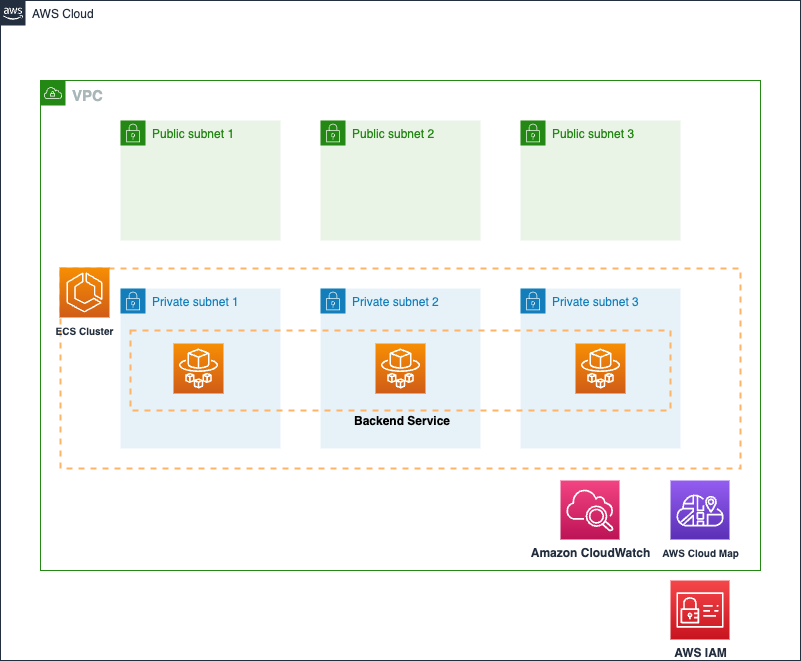

# ECS backend service with service discovery

This solution blueprint creates a backend service that **does not** sit behind a load balancer. The backend service has a service discovery name registered with AWS Cloud Map. Other services running in this cluster can access the backend service using the service discovery name. Below are the steps for deploying this service:

* Copy `sample.env` to `.env` and change the `account_number`, `aws_region`, `repository_owner` values in the **Essential Props** of the `.env` file:
```bash
# Essential Props
repository_owner="<REPO_OWNER>"
account_number="<ACCOUNT_NUMBER>"
aws_region="<REGION>"
```

* If you didn't deploy the [core_infra](../core_infra/README.md), set the value of **deploy_core_stack** in the `.env` file to **True**. This automatically provision not only *backend service*, but also *core infra*. In this case, you can set the values of **core stack props**.
```bash
deploy_core_stack="True"

# Core Stack Props
vpc_cidr="10.0.0.0/16"
ecs_cluster_name="ecs-blueprint-infra"
namespaces="default"
enable_nat_gw="True"
az_count="3"
```

* But if you have already deployed the [core_infra](../core_infra/README.md) or have your own core infra, then you can reuse it as well. Set `deploy_core_stack` value to `False`. And modify the variables inside `.env` so that CDK can import your VPC, ECS Cluster and your task execution role. You can find those variables by looking at the core infrastructure modules outputs in AWS CloudFormation. Also, if you want to use `application-code`'s example.

* Run CDK ls command to figure out lists of the stacks in the app. The list of CDK stack may differ depending on the `deploy_core_stack` value.
```bash
cdk ls
```

* Deploy the CDK templates in this repository using `cdk deploy`.
```bash
cdk deploy --all --require-approval never --outputs-file output.json
```

# Outputs
After the execution of the CDK code, the outputs will be in the `output.json` file. The IDs and values can be used as input for the next CDK modules. You can use this infrastructure to run other example blueprints.


<p align="center">
  
</p>

This solution has following key components:

* **AWS Cloud Map** for service discovery: The backend service can be given a service discovery name such as `backend.default.cluster-name.local`. The `backend` is service name, and `default` is the namespace alongwith further qualifier of `cluster-name.local`. Other services can interact with the backend service using the service discovery name. Here are the key aspects to note:
    * The namespace (i.e. `default.cluster-name.local`) is created in the [core_infra](../core_infra/README.md) blueprint. Many services can be registered to a namespace that is why we don't create the namespace in a specific service definition. We created them in the core-infra blueprint and you can easily add more namespaces there
    * We use `aws_service_discovery_dns_namespace` datasource to search and fetch the namespace.
    * The `aws_service_discovery_service` resource is used to register the service to the namespace. You see the record type, TTL, and health check setting in this resource.
* **Amazon ECR repository** for the container image. We are using only one container image for the task in this example.
* **Amazon ECS** service definition:
    * Task security group: allows ingress for TCP from all IP address in the VPC CIDR block to the container port (3000 in this example). And allows all egress.
    * Service discovery ARN is used in the service definition. ECS will automatically manage the registration and deregistration of tasks to this service discovery registry.
    * Tasks for this service will be deployed in private subnet.
    * Task definition consisting of task vCPU size, task memory, and container information including the above created ECR repository URL.
    * Task definition also takes the task execution role ARN which is used by ECS agent to fetch ECR images and send logs to Amazon CloudWatch on behalf of the task.

The second half of this example focuses on creating CI/CD pipeline using AWS CodePipeline and CodeBuild. This has following main components:

* **Please make sure you have stored the Github access token in AWS Secrets Manager as a plain text secret (not as key-value pair secret). This token is used to access the *application-code* repository and build images.**

* S3 bucket to store CodePipeline assets. The bucket is encrypted with AWS managed key.
* CodeBuild for building container images
    * Needs the S3 bucket created above
    * IAM role for the build service
    * The *buildspec_path* is a key variable to note. It points to the [buildspec.yml](https://github.com/aws-ia/ecs-blueprints/blob/main/application-code/ecsdemo-nodejs/templates/buildspec.yml) file which has all the instructions not only for building the container but also for pre-build processing and post-build artifacts preparation required for deployment.
    * A set of environment variables including repository URL and folder path.
* CodePipeline to listen for changes to the repository and trigger build and deployment.
    * Needs the S3 bucket created above
    * Github token from AWS Secrets Manager to access the repository with *application-code* folder
    * Repository owner
    * Repository name
    * Repository branch
    * The cluster and service names for deploying the tasks with new container images
    * The image definition file name which contains mapping of container name and container image. These are the containers used in the task.
    * IAM role

Note that the CodeBuild and CodePipeline services are provisioned and configured here. However, they primarily interact with the `application-code/ecsdemo-backend` repository. CodePipeline is listening for changes and checkins to that repository. And CodeBuild is using the *Dockerfile* and *templates/* files from that application folder.

# Cleanup
When you clean up `backend_service` blueprints, AWS CloudFormation cannot delete a non-empty Amazon ECR repository. Therefore, before executing cdk destroy command, executing aws ecr delete-repository is needed.
```bash
# backend_service repository deletion
aws ecr delete-repository --repository-name ecsdemo-backend --force

cdk destroy
```