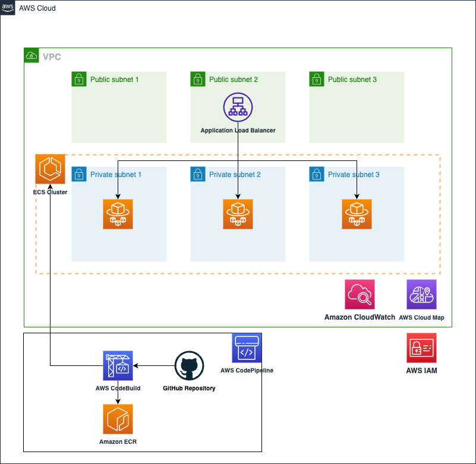

# ECS service with CI/CD pipeline

This blueprint creates ECS service with CI/CD pipeline by using AWS CodePipeline and CodeBuild. Below are the steps for deploying this service. This blueprint requires [Git](https://github.com/git-guides/install-git) and creating a [Github token](https://docs.github.com/en/authentication/keeping-your-account-and-data-secure/creating-a-personal-access-token) to access the forked repository. Please refer [this README file](https://github.com/aws-ia/ecs-blueprints/tree/main/cdk#:~:text=us%2Dwest%2D2-,Quick%20Start,-Fork%20this%20repository) ahead.

* Copy `sample.env` to `.env` and change the `account_number`, `aws_region` and `repository_owner` values in the Essential Props of the `.env` file:
```bash
# Essential Props
account_number="<ACCOUNT_NUMBER>"
aws_region="<REGION>"
repository_owner="<REPO_OWNER>"
```

* If you didn't deploy the [core_infra](../core_infra/README.md), set the value of **deploy_core_stack** in the `.env` file to **True**. This automatically provision not only *ECS service and CI/CD pipeline*, but also *core infra*. In this case, you can set the values of **core stack props**.
```bash
deploy_core_stack="True"

# Core Stack Props
vpc_cidr="10.0.0.0/16"
ecs_cluster_name="ecs-blueprint-infra"
namespaces="default"
enable_nat_gw="True"
az_count="3"
```

* But if you have already deployed the [core_infra](../core_infra/README.md) or have your own core infra, then you can reuse it as well. In that case, set `deploy_core_stack` value to `False`. And modify the variables inside `.env` so that CDK can import your VPC, ECS Cluster and your task execution role. You can find those variables by looking at the core infrastructure modules outputs in AWS CloudFormation.

* Run CDK ls command to figure out lists of the stacks in the app. The list of CDK stack may differ depending on the `deploy_core_stack` value.
```bash
cdk ls
```

* Deploy the CDK templates in this repository using `cdk deploy`.
```bash
cdk deploy --all --require-approval never
```

<p align="center">
  
</p>

The solution has following key components:

* **Application Load Balancer**: We are using Application Load Balancer for this service. Note the following key attributes for ALB:
  * ALB security group - allows ingress from any IP address to port 80 and allows all egress
  * ALB subnet - ALB is created in a public subnet
  * Listener - listens on port 80 for protocol HTTP
  * Target group - Since we are using Fargate launch type, the targe type is IP since each task in Fargate gets its own ENI and IP address. The target group has container port(80) and protocol (HTTP) where the application container will serve requests. The ALB runs health check against all registered targets. In this example, ALB send HTTP GET request to path "/" to container port 80. We are using target group default health check settings. You can tune these settings to adjust the time interval and frequency of health checks. It impacts how fast tasks become available to serve traffic(See [ALB target health check documentation](https://docs.aws.amazon.com/elasticloadbalancing/latest/application/target-group-health-checks.html) to learn more).
* **Amazon ECR repository** for the container image. We are using only one container image for the task in this example.
* **Amazon ECS** service definition:
  * Task security group: allows ingress for TCP from the ALB security group to the container service port (80 for this example). And allows all egress.
  * Service discovery: You can register the service to AWS Cloud Map registry. You just need to provide the `namespace` but make sure the namespace is created in the `core_infra` step.
  * Tasks for this service will be deployed in private subnet
  * Service definition takes the load balancer target group created above as input.
  * Task definition consisting of task vCPU size, task memory, and container information including the above created ECR repository URL.
  * Task definition also takes the task execution role ARN which is used by ECS agent to fetch ECR images and send logs to AWS CloudWatch on behalf of the task.

The second half of `lib/cicd_service_stack.py` focuses on creating CI/CD pipeline using AWS CodePipeline and CodeBuild. This has following main components:

* **Please make sure you have stored the Github access token in AWS Secrets Manager as a plain text secret (not as key-value pair secret). This token is used to access the *application-code* repository and build images.**

* S3 bucket to store CodePipeline assets. The bucket is encrypted with AWS managed key.
* CodeBuild for building container images
  * Needs the S3 bucket created above
  * IAM role for the build service
  * The *buildspec_path* is a key variable to note. It points to the [buildspec.yml](https://github.com/aws-ia/ecs-blueprints/blob/main/application-code/ecsdemo-cicd/buildspec.yml) file which has all the instructions not only for building the container but also for pre-build processing and post-build artifacts preparation required for deployment.
  * A set of environment variables including repository URL and folder path.
* CodePipeline to listen for changes to the repository and trigger build and deployment.
  * Needs the S3 bucket created above
  * Github token from AWS Secrets Manager to access the repository with *application-code* folder
  * Repository owner
  * Repository name
  * Repository branch
  * The cluster and service names for deploying the tasks with new container images
  * The image definition file name which contains mapping of container name and container image. These are the containers used in the task.
  * IAM role

Note that the CodeBuild and CodePipeline services are provisioned and configured here. However, they primarily interact with the *application-code/ecsdemo-frontend* repository. CodePipeline is listening for changes and checkins to that repository. And CodeBuild is using the *Dockerfile* and *templates/* files from that application folder.

## Cleanup
When you clean up `cicd_service` blueprints, AWS CloudFormation cannot delete a non-empty Amazon ECR repository. Therefore, before executing cdk destroy command, executing aws ecr delete-repository is needed.
```bash
# cicd_service repository deletion
aws ecr delete-repository --repository-name ecsdemo-cicd --force
cdk destroy
```
