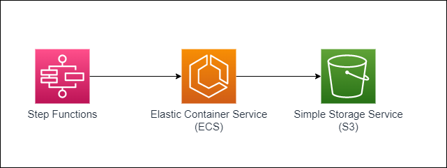
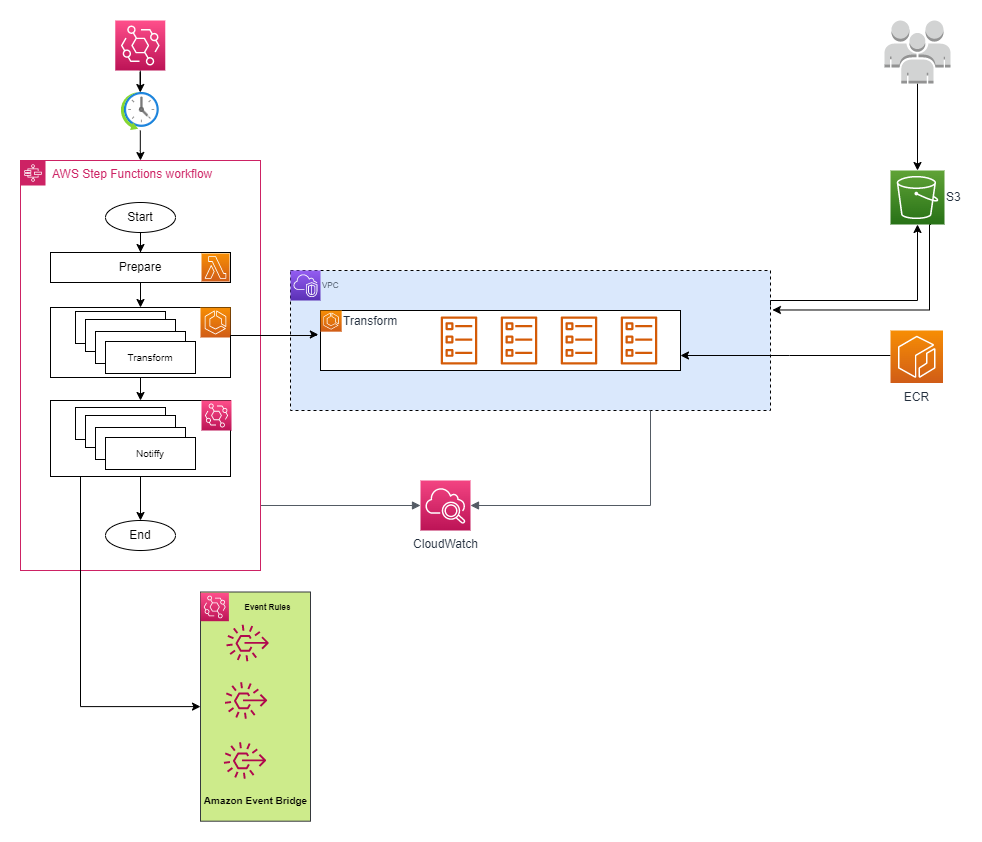

# ECS Fargate parallel data processing using StepFunctions
<p align="center">
  
</p>

One of the most commonly used patterns for Step Functions is the invocation of Lambda functions to perform tasks. While this works well for use cases with short lived tasks, the short time constraints of lambda do not work well with use cases that require longer running tasks.  For example, consider the use case of regulators that process data submitted by hundreds of thousands of clients. This data is usually processed in batches and in some cases, on an ad-hoc basis.  Data processing tasks, whether it is preparing data or transforming large data sets, are time consuming. Lambda functions can run for up to 15 minutes, at which point they will timeout, regardless of the state they are in, meaning that loss of data or worse things may happen (data corruption for example). In addition to the potential failure because of the timeout, we have to also consider the costs. Lambda functions are billed by 1ms segments, and while they are cheap, the longer they run, the more expensive they become. Additionally, functions that do compute heavy work may require more memory allocated to them, and adding memory to a Lambda increases the runtime cost. 

This is where ECS (Elastic Container Service) shines. ECS allows you to run containers quickly and easily on AWS servers, so all you need is a working container image with your app/task code bundled in and you can quickly deploy full applications/tasks without a lot of the deployment overhead.  In the data processing use case above, ECS allows you to run longer running tasks that prepare and process large data sets as tasks. Additionally, you can configure memory and CPU requirements for the different types of tasks you have in your workflow. This results in lower costs as well as a more efficient workflow.  Different integrations with various AWS services provide the flexibility to adapt to any kind of workload that you may have. 

This solution blueprint deploys an end to end data processing pipeline using Lambda, ECS Fargate and S3. This blueprint enables you to process a large number of files in S3 in parallel and pass the files on to be consumed by another job or service. For example, validating the incoming files from clients and cleaning up the data for further processing.

The solution is implemented as a StepFunction workflow that integrates with ECS to perform the validation steps and notifies different systems at the end of the workflow to indicate completion. The validation step is broken down into multiple parallel tasks, working on different chunks of the dataset. Once the workflow is complete, it sends an event so downstream systems that are interested in the completion event can take action on the processed data. 

The above solution can be used not only for batch processing, but is flexible enough to be used with On Demand processing as well.

This blueprint expects csv data files uploaded to an S3 source bucket, in a "__prefix__/incoming/" folder. At a given schedule configured in EventBridge, the workflow is triggered to process the uploaded files.

* **NOTE:** The blueprint deployment requires the ecs container to exist in your repository. An example task is provided under application-code/data-pipeline-task in the root of the blueprint repository. Use the below command to build and deploy the container image. Please ensure Docker daemon is running prior to building the image and aws cli is configured for an account and region and your role has permissions to deploy to ECR.
  * `./build.sh -i process-data`

* Once this is created, you will only run the above steps if there are changes to the task.
* Now you can deploy this blueprint
```shell
cdk bootstrap
cdk deploy
```
* To test, upload a lot of `.csv` files to the S3 source bucket (data-processing-incoming-bucket) under different __prefix__/incoming/ folders.

* Trigger the StepFunction workflow in the AWS Management console or wait for the Eventbridge rule to trigger.

## Blueprint Architecture

<p align="center">
  
</p>

The solution has following key components:

* S3 source bucket to upload the csv files.
* StepFunction workflow that orchestrates the processing pipeline
* Lambda function that prepares the data for submission to ecs tasks. 
* Parallel ECS Fargate tasks process the csv files from source S3 bucket and log the validation output in Cloudwatch. This can be modified to output clean files to another S3 bucket or load the data into a database.
* EventBridge event that indicates the processing result for the files in a  __prefix__
