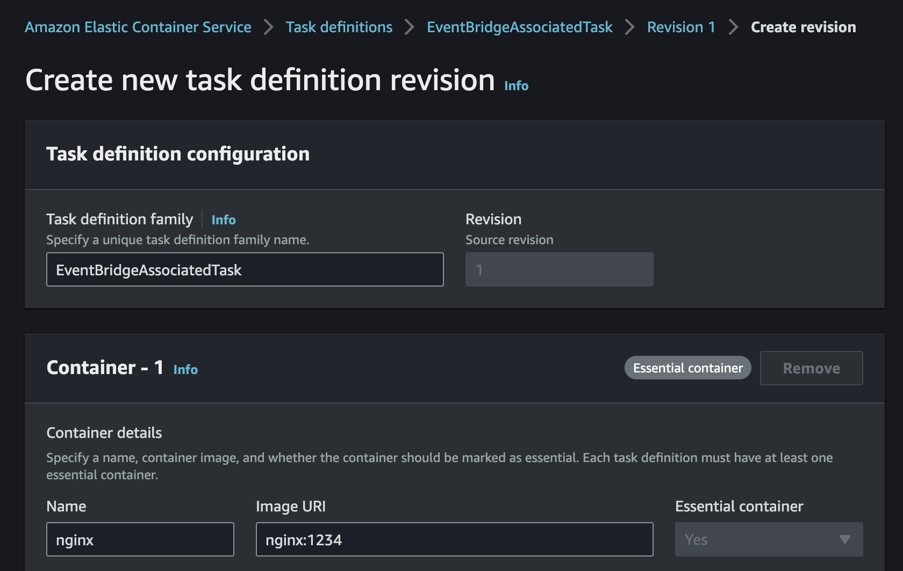
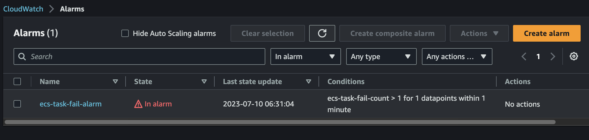
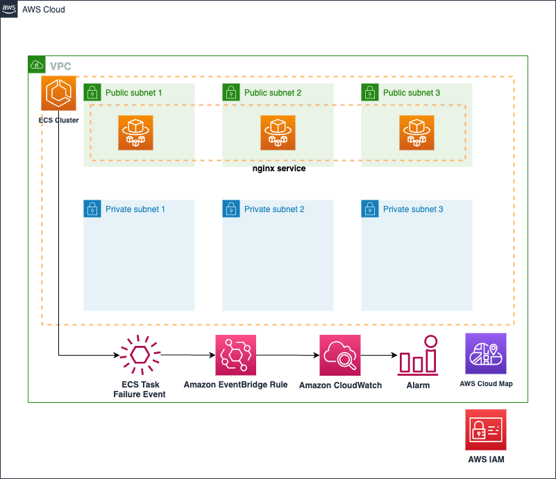
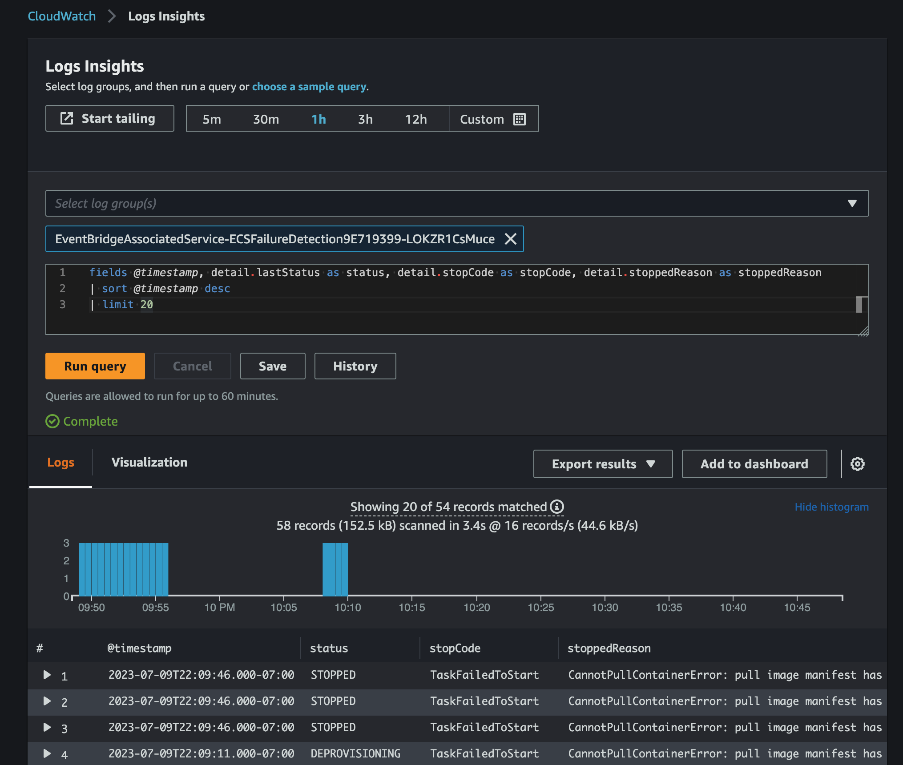

# ECS Task Failure Detection with Amazon EventBridge

This blueprint detects a failure event when your ECS tasks stopped due to [various reasons](https://docs.aws.amazon.com/AmazonECS/latest/userguide/stopped-task-error-codes.html). This blueprint consists of ECS service, [Amazon EventBridge rule](https://docs.aws.amazon.com/eventbridge/latest/userguide/eb-rules.html), Amazon CloudWatch Logs, Metrics and Alarm. When an event that matches the [*event pattern*](https://docs.aws.amazon.com/eventbridge/latest/userguide/eb-event-patterns.html) specified in Amazon EventBridge rule occurs, it is send to the [*target*](https://docs.aws.amazon.com/eventbridge/latest/userguide/eb-targets.html) for processing. In this scenario, we set this target to CloudWatch log group. But you can configure target with other AWS services. Also, a single rule can have more than one target.

Given that we've configured an event pattern with the conditions that [ECS stopCode](https://docs.aws.amazon.com/AmazonECS/latest/APIReference/API_Task.html#:~:text=Required%3A%20No-,stopCode,-The%20stop%20code) is **TaskFailedToStart** or **EssentialContainerExited**, any events fitting these conditions from the ECS cluster will be saved in the CloudWatch log group which name contains **ECSFailureDetection**. And each time the logs are accumulated, the metric named **ecs-task-fail-count** is counted by this log group's [*Metric filter*](https://docs.aws.amazon.com/AmazonCloudWatch/latest/logs/CreateMetricFilterProcedure.html). Subsequently, CloudWatch alarm associated with this metric will be triggered.

Below are the steps for deploying this service:

* Copy `sample.env` to `.env` and change the `account_number` an `aws_region`(example, us-west-2) values in the **Essential Props** of the `.env` file:
```bash
# Essential Props
export AWS_ACCOUNT=$(aws sts get-caller-identity --query 'Account' --output text)
export AWS_REGION=${AWS_REGION:=us-west-2}

sed -e "s/<ACCOUNT_NUMBER>/$AWS_ACCOUNT/g" \
  -e "s/<REGION>/$AWS_REGION/g" sample.env > .env
```

* If you didn't deploy the [core_infra](../core_infra/README.md), set the value of **deploy_core_stack** in the `.env` file to **True**. This automatically provision not only *backend service*, but also *core infra*. In this case, you can set the values of **core stack props**.
```bash
deploy_core_stack="True"

# Core Stack Props
vpc_cidr="10.0.0.0/16"
ecs_cluster_name="ecs-blueprint-infra"
namespaces="default"
enable_nat_gw="True"
az_count="3"
```

* But if you have already deployed the [core_infra](../core_infra/README.md) or have your own core infra, then you can reuse it as well. In that case, set `deploy_core_stack` value to `False`. And modify the variables inside `.env` so that CDK can import your VPC, ECS Cluster and your task execution role. You can find those variables by looking at the core infrastructure modules outputs in AWS CloudFormation.

* Run CDK ls command to figure out lists of the stacks in the app. The list of CDK stack may differ depending on the `deploy_core_stack` value.
```bash
cdk ls
```

* Deploy the CDK templates in this repository using `cdk deploy`.
```bash
cdk deploy --all --require-approval never --outputs-file output.json
```

# Test
To verify if the CloudWatch alarm is functioning properly, we're going to specify an invalid container image called **nginx:1234** in ECS Task definition instead of using the default **nginx**.

If updating the ECS task definition is cumbersome, change the **container_image** value to **nginx:1234** in the `.env` file and deploy CDK stacks.

<p align="center">
  
</p>

Update existing ECS service with new ECS Task definition.
```bash
aws ecs update-service --cluster ecs-blueprint-cluster --service sample-service --task-definition EventBridgeAssociatedTask --region ${AWS_REGION}
```

Move to the CloudWatch Alarm page, you can observe **ecs-task-fail-alarm** state become **In alarm**.

<p align="center">
  
</p>

# Outputs
After the execution of the CDK code, the outputs will be in the `output.json` file. The IDs and values can be used as input for the next CDK modules. You can use this infrastructure to run other example blueprints.


<p align="center">
  
</p>

This solution has following key components:

* **Amazon ECS** service definition:
    * Task security group: allows ingress for TCP from all IP address to the container port (80 in this example). And allows all egress.
    * Service discovery ARN is used in the service definition. ECS will automatically manage the registration and deregistration of tasks to this service discovery registry.
    * Tasks for this service will be deployed in public subnet.
    * Task definition consisting of task vCPU size, task memory, and container information.
    * Task definition also takes the task execution role ARN which is used by ECS agent to fetch ECR images and send logs to Amazon CloudWatch on behalf of the task.
* **Amazon EventBridge** Rule:
    * A rule matches incoming events and sends them to targets for processing.
    * In this case, this rule detects **TaskFailedToStart** or **EssentialContainerExited** events and will send this event's logs to its target, **CloudWatch Log group**.
    * Below is the EventBridge Rule's *event pattern*.
    ```json
    {
        "source": ["aws.ecs"],
        "detail-type": ["ECS Task State Change"],
        "detail": {
            "clusterArn": ["${ECS_CLUSTER_ARN}"],
            "$or": [{
            "stopCode": ["TaskFailedToStart"]
            }, {
            "stopCode": ["EssentialContainerExited"]
            }]
        }
    }
    ```
* **Amazon CloudWatch** Log groups:
    * CloudWatch log group is a group of log streams that share the same retention, monitoring and access control settings. And a log stream is a sequence of log events that share the same source. Therefore, each separate source of logs makes up a separate log stream.
    * In this blueprint, you can observe two different log groups. One is for the ECS service and the other is for the event from EventBridge's Rule which name contains **ECSFailureDetection**.
    * **ECSFailureDetection log group** configured with a [*metric filter*](https://docs.aws.amazon.com/AmazonCloudWatch/latest/monitoring/Create_alarm_log_group_metric_filter.html) to create metric used for CloudWatch alarm.
* **Amazon CloudWatch** Log Insights:
   * CloudWatch Logs Insights enables you to search and analyze your log data in Amazon CloudWatch Logs.
   * For example here is a query that shows stopped task state changes.

   ```bash
    fields @timestamp, detail.lastStatus as status, detail.stopCode as stopCode, detail.stoppedReason as stoppedReason
    | sort @timestamp desc
    | limit 20
   ```
   <p align="center">
      
   </p>

* **Amazon CloudWatch** Alarms:
   * CloudWatch's *metric alarm* watches a single CloudWatch metric. Not in this blueprint, but you can add one or more *actions* triggering during a threshold over. For exmaple, the action can be sending to a notification to an Amazon SNS topic.

# Cleanup
To proceed with deleting the stack, use `cdk destroy`
```bash
cdk destroy
```
