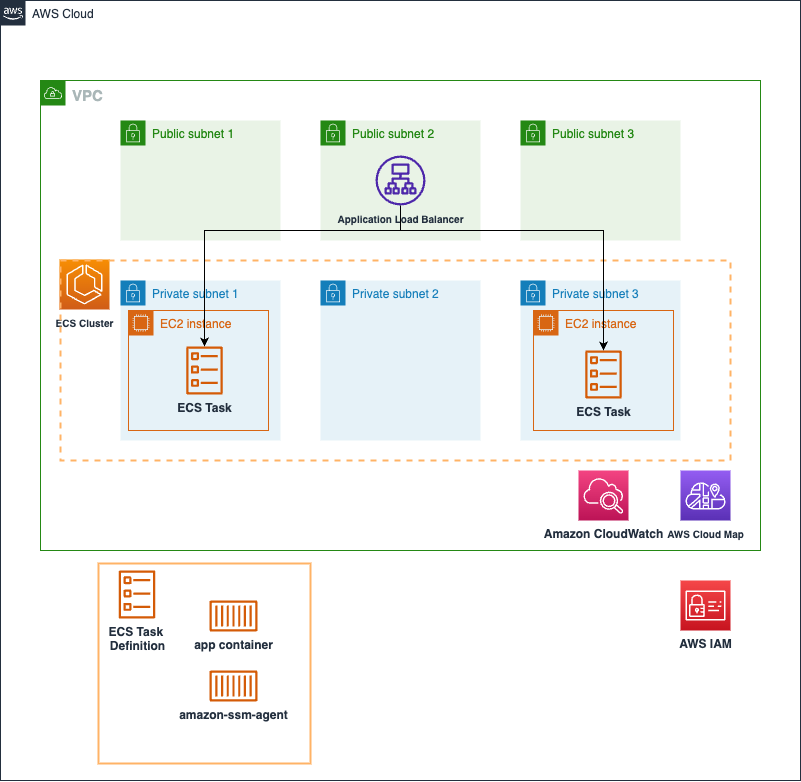

# ECS Service for AWS FIS(Fault Injection Simulator)

This blueprint creates a web-facing load balanced ECS service for AWS FIS. Below are the steps for deploying this service.


* Copy `sample.env` to `.env` and change the `account_number` and `aws_region`(example, us-west-2) values in the Essential Props of the `.env` file:
```bash
# Essential Props
export AWS_ACCOUNT=$(aws sts get-caller-identity --query 'Account' --output text)
export AWS_REGION=${AWS_REGION:=us-west-2}

sed -e "s/<ACCOUNT_NUMBER>/$AWS_ACCOUNT/g" \
  -e "s/<REGION>/$AWS_REGION/g" sample.env > .env
```

* If you didn't deploy the [core_infra](../core_infra/README.md), set the value of **deploy_core_stack** in the `.env` file to **True**. This automatically provision not only *frontend service*, but also *core infra*. In this case, you can set the values of **core stack props**.
```bash
deploy_core_stack="True"

# Core Stack Props
vpc_cidr="10.0.0.0/16"
ecs_cluster_name="ecs-blueprint-infra"
namespaces="default"
enable_nat_gw="True"
az_count="3"
```

* But if you have already deployed the [core_infra](../core_infra/README.md) or have your own core infra, then you can reuse it as well. In this case, set `deploy_core_stack` value to `False`. And modify the variables inside `.env` so that CDK can import your VPC, ECS Cluster and your task execution role. You can find those variables by looking at the core infrastructure modules outputs in AWS CloudFormation.

* Run CDK ls command to figure out lists of the stacks in the app. The list of CDK stack may differ depending on the `deploy_core_stack` value.
```bash
cdk ls
```

* Deploy the CDK templates in this repository using `cdk deploy`.
```bash
cdk deploy --all --require-approval never
```

<p align="center">
  
</p>

The solution has following key components:

* **Application Load Balancer**: We are using Application Load Balancer for this service. Note the following key attributes for ALB:
  * ALB security group - allows ingress from any IP address to port 80 and allows all egress
  * ALB subnet - ALB is created in a public subnet
  * Listener - listens on port 80 for protocol HTTP
  * Target group: Since we are using Fargate launch type, the targe type is IP because each task in Fargate gets its own ENI and IP address. The target group has container port(80) and protocol(HTTP) where the application container will serve requests. The ALB runs health check against all registered targets(See [ALB target health check documentation](https://docs.aws.amazon.com/elasticloadbalancing/latest/application/target-group-health-checks.html) to learn more).
* **Amazon ECS** service definition:
  * Task security group: allows ingress for TCP from the ALB security group to the container service port (80 for this example). And allows all egress
  * Service discovery: You can register the service to AWS Cloud Map registry. You just need to provide the `namespace` but make sure the namespace is created in the `core_infra` step
  * Tasks for this service will be deployed in private subnet
  * Service definition takes the load balancer target group created above as input
  * Task definition consisting of task vCPU size, task memory, and container information
  * Two containers are defined in the task definition. One is for the simple nginx and the other is amazon-ssm-agent container for registering ECS Task as a SSM Managed Instance.
  * Task definition also takes the task execution role ARN which is used by ECS agent to fetch ECR images and send logs to AWS CloudWatch on behalf of the task.

## Cleanup
To proceed with deleting the stack, use `cdk destroy`
```bash
cdk destroy
```
