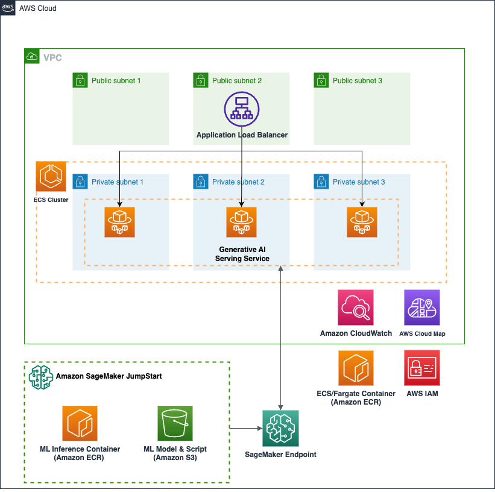

# ECS Generative AI service with Amazon SageMaker JumpStart

This sample is developed using [AWS Blog - Deploy generative AI models from Amazon SageMaker JumpStart using the AWS CDK](https://aws.amazon.com/blogs/machine-learning/deploy-generative-ai-models-from-amazon-sagemaker-jumpstart-using-the-aws-cdk/) as a reference.

This blueprint creates Generative AI serving ECS service with [Amazon SageMaker JumpStart](https://docs.aws.amazon.com/sagemaker/latest/dg/studio-jumpstart.html). Below are the steps for deploying this service. This blueprint requires [Docker command line](https://docs.docker.com/engine/reference/commandline/cli/) for building ECS service container image locally.

* Copy `sample.env` to `.env` and change the `account_number`, `aws_region`(example, us-west-2) values in the Essential Props of the `.env` file:
```bash
# Essential Props
export AWS_ACCOUNT=$(aws sts get-caller-identity --query 'Account' --output text)
export AWS_REGION=${AWS_REGION:=us-west-2}

aws configure set default.region ${AWS_REGION}

sed -e "s/<ACCOUNT_NUMBER>/$AWS_ACCOUNT/g" \
  -e "s/<REGION>/$AWS_REGION/g" sample.env > .env
```

* If you didn't deploy the [core_infra](../core_infra/README.md), set the value of **deploy_core_stack** in the `.env` file to **True**. This automatically provision not only *Generative AI service*, but also *core infra*. In this case, you can set the values of **core stack props**.
```bash
deploy_core_stack="True"

# Core Stack Props
vpc_cidr="10.0.0.0/16"
ecs_cluster_name="ecs-blueprint-infra"
namespaces="default"
enable_nat_gw="True"
az_count="3"
```

* But if you have already deployed the [core_infra](../core_infra/README.md) or have your own core infra, then you can reuse it as well. In that case, set `deploy_core_stack` value to `False`. And modify the variables inside `.env` so that CDK can import your VPC, ECS Cluster and your task execution role. You can find those variables by looking at the core infrastructure modules outputs in AWS CloudFormation.

* Below is the variables relevant with Amazon SageMaker JumpStart. If you want to use another `model_id` or `inference_instance_type`, modifying these variables is needed.
```bash
deploy_jumpstart_stack="True"

# SageMaker Props
model_id="model-txt2img-stabilityai-stable-diffusion-v2-1-base"
inference_instance_type="ml.g4dn.4xlarge"
```

* To work with python CDK project, below step is needed.
```bash
python3 -m venv .venv
source .venv/bin/activate
python -m pip install -r requirements.txt
```

* Run CDK ls command to figure out lists of the stacks in the app. The list of CDK stack may differ depending on the `deploy_core_stack` value.
```bash
cdk ls
```

* Deploy the CDK templates in this repository using `cdk deploy`. While it's possible for you to deploy all three CDK stacks all at once, this guide proposes a method of deploying them in two steps. The deployment of the SageMaker environment is carried out in the first step. This step takes around 8+ minutes.
```bash
cdk deploy GenAISageMakerStack --require-approval never
```
In the second step, we proceed with the deployment of [core_infra](../core_infra/README.md) and Generative AI serving ECS service.
```bash
cdk deploy CoreInfraStack, GenAIService --require-approval never
```

<p align="center">
  
</p>

The solution has following key components:
* **Amazon SageMaker JumpStart**: Amazon SageMaker JumpStart provides pre-trained, open-source models for a wide range of problem types to help you get started with ML. You can incrementally train and tune these models before deployment as well. In this blueprints, you can check SageMaker JumpStart infrastructure stack in [here](../other_stack/generative_ai_sagemaker_stack.py).
* **Application Load Balancer**: We are using Application Load Balancer for this service. Note the following key attributes for ALB:
  * ALB security group - allows ingress from any IP address to port 8501(Streamlit default port) and allows all egress
  * ALB subnet - ALB is created in a public subnet
  * Listener - listens on port 8501 for protocol HTTP
  * Target group: Since we are using Fargate launch type, the targe type is IP because each task in Fargate gets its own ENI and IP address. The target group has container port(80) and protocol(HTTP) where the application container will serve requests. The ALB runs health check against all registered targets(See [ALB target health check documentation](https://docs.aws.amazon.com/elasticloadbalancing/latest/application/target-group-health-checks.html) to learn more).
* **Amazon ECS** service definition:
  * Task security group: allows ingress for TCP from the ALB security group to the container service port (8501 for this example). And allows all egress
  * Service discovery: You can register the service to AWS Cloud Map registry. You just need to provide the `namespace` but make sure the namespace is created in the `core_infra` step
  * Tasks for this service will be deployed in private subnet
  * Service definition takes the load balancer target group created above as input
  * Task definition consisting of task vCPU size, task memory, and container information
  * The container defined in the task definition is serving Generative AI service by associating with Amazon SageMaker Endpoint.
  * Task definition also takes the task execution role ARN which is used by ECS agent to fetch ECR images and send logs to AWS CloudWatch on behalf of the task.

## Cleanup
To proceed with deleting the stack, use `cdk destroy`
```bash
cdk destroy --all
```
