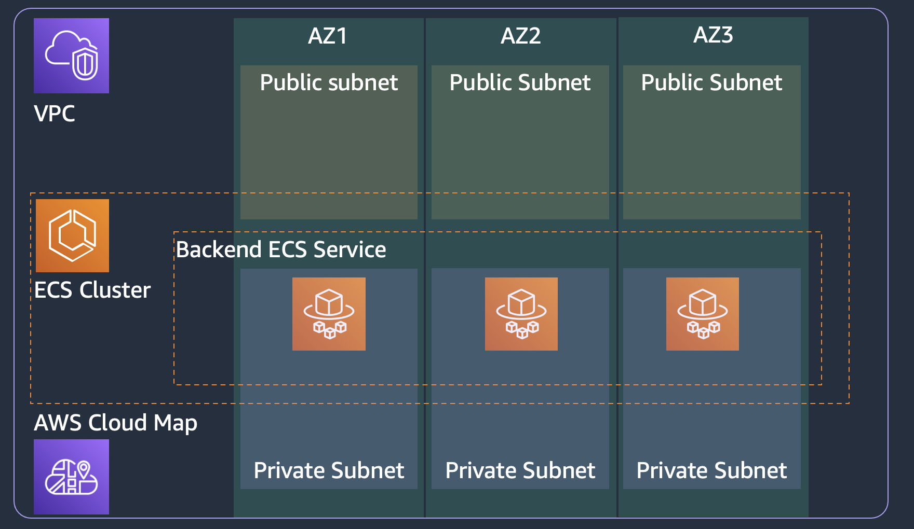

# ECS backend service with service discovery

This solution blueprint creates a backend servie that **does not** sit behind a load balancer. The backend service has a service discovery name registered with AWS Cloud Map. Other services running in this cluster can access the backend service using the service discovery name. Below are steps for deploying this service:

* Deploy the [core-infra](../core-infra/README.md). Note if you have already deployed the infra then you can reuse it as well.
* In this folder, copy the `terraform.tfvars.example` file to `terraform.tfvars` and update the variables.
* **NOTE:** Codestar notification rules require a **one-time** creation of a service-linked role. Please verify one exists or create the codestar-notification service-linked role.
  * `aws iam get-role --role-name AWSServiceRoleForCodeStarNotifications`

    ```An error occurred (NoSuchEntity) when calling the GetRole operation: The role with name AWSServiceRoleForCodeStarNotifications cannot be found.```
  *  If you receive the error above, please create the service-linked role with the `aws cli` below.
  * `aws iam create-service-linked-role --aws-service-name codestar-notifications.amazonaws.com`
  * Again, once this is created, you will not have to complete these steps for the other examples.
* Now you can deploy this blueprint
```shell
terraform init
terraform plan
terraform apply -auto-approve
```
* To test the backend service access using service discovery, deploy the [lb-service](../lb-service/README.md) along with providing the name of this backend service.

<p align="center">
  
</p>

The solution has following key components:

* Service discovery using AWS Cloud Map: The backend service can be given a service discovery name such as `backend.default.cluster-name.local`. The `backend` is service name, and `default` is the namespace alongwith further qualifier of `cluster-name.local`. Other services can interact with the backend service using the service discovery name. Here are the key aspects to note:
    * The namespace (i.e. `default.cluster-name.local`) is created in the [core-infra](../core-infra/README.md) blueprint. Many services can be registered to a namespace that is why we don't create the namespace in a specific service definition. We created them in the core-infra blueprint and you can easily add more namespaces there
    * We use `aws_service_discovery_dns_namespace` datasource to search and fetch the namespace.
    * The `aws_service_discovery_service` resource is used to register the service to the namespace. You see the record type, TTL, and health check setting in this resource.
* ECR registery for the container image. We are using only one container image for the task in this example.
* ECS service definition:
    * Task security group: allows ingress for TCP from all IP address in the VPC CIDR block to the container port (3000 in this example). And allows all egress.
    * Service discovery ARN is used in the service definition. ECS will automatically manage the registration and deregistration of tasks to this service discovery registry.
    * Tasks for this service will be deployed in private subnet
    * Task definition consisting of task vCPU size, task memory, and container information including the above created ECR repository URL.
    * Task definition also takes the task execution role ARN which is used by ECS agent to fetch ECR images and send logs to AWS CloudWatch on behalf of the task.

The second half of `main.tf` focuses on creating the CI/CD pipeline using AWS CodePipeline and CodeBuild. This has following main components:

* **Please make sure you have stored the Github access token in AWS Secrets Manager as a plain text secret (not as key-value pair secret). This token is used to access the *application-code* repository and build images.**
* S3 bucket to store CodePipeline assets. The bucket is encrypted with AWS managed key.
* SNS topic for notifications from the pipeline
* CodeBuild for building container images
    * Needs the S3 bucket created above
    * IAM role for the build service
    * The *buildspec_path* is a key variable to note. It points to the [buildspec.yml](../../application-code/ecsdemo-nodejs/templates/buildspec.yml) file which has all the instructions not only for building the container but also for pre-build processing and post-build artifacts preparation required for deployment.
    * A set of environment variables including repository URL and folder path.
* CodePipeline to listen for changes to the repository and trigger build and deployment.
    * Needs the S3 bucket created above
    * Github token from AWS Secrets Manager to access the repository with *application-code* folder
    * Repository owner
    * Repository name
    * Repository branch
    * SNS topic for notifications created above
    * The cluster and service names for deploying the tasks with new container images
    * The image definition file name which contains mapping of container name and container image. These are the containers used in the task.
    * IAM role

Note that the CodeBuild and CodePipeline services are provisioned and configured here. However, they primarily interact with the *application-code/ecsdemo-nodejs* repository. CodePipeline is listening for changes and checkins to that repository. And CodeBuild is using the *Dockerfile* and *templates/* files from that application folder.
