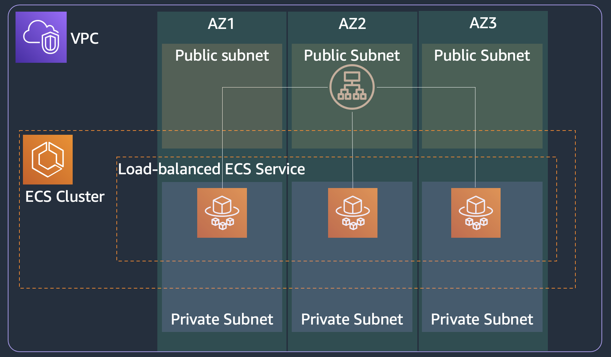

# ECS load-balanced service

This solution blueprint creates a generic ECS service with load balancer. The blueprint also creates SSM Parameter Store for both plain text configurations and sensitive secrets. This blueprint **does not** provide CI/CD and **does not** connect to any application repository. You need to provide the image repository URLs in container definitions. 

* Deploy the [core-infra](../core-infra/README.md). Note if you have already deployed the infra then you can reuse it as well. The `core-infra` example creates `default.core-infra.local` DNS namespace in CloudMap. You can create more by editing the `dns_namespaces` list in [main.tf](../core-infra/main.tf). 

* In this folder, copy the `terraform.tfvars.example` file to `terraform.tfvars` and update the variables.
 
* Now you can deploy this blueprint
```shell
terraform init
terraform plan
terraform apply -auto-approve
```

<p align="center">
  
</p>

The solution has following key components:

* ALB: We are using Application Load Balancer for this service. Note the following key attributes for ALB:
    * ALB security group - allows ingress from any IP address to port 80 and allows all egress
    * ALB subnet - ALB is created in a public subnet
    * Listener - listens on port 80 for protocol HTTP
    * Target group - Since we are using Fargate launch type, the targe type is IP since each task in Fargate gets its own ENI and IP address. The target group has container port (3000) and protocol (HTTP) where the application container will serve requests. The ALB runs health check against all registered targets. In this example, ALB send HTTP GET request to path "/" to container port 3000. We are using target group default health check settings. You can tune these settings to adjust the time interval and frequency of health checks. It impacts how fast tasks become available to serve traffic. (See [ALB target health check documentation](https://docs.aws.amazon.com/elasticloadbalancing/latest/application/target-group-health-checks.html) to learn more.)
* ECS service definition:
    * Task security group: allows ingress for TCP from the ALB security group to the container service port (3000 for this example). And allows all egress.
    * Service discovery: You can register the service to AWS Cloud Map registry. You just need to provide the `namespace` but make sure the namespace is created in the `core-infra` step.
    * Tasks for this service will be deployed in private subnet
    * Service definition takes the load balancer target group created above as input.
    * Task definition consisting of task vCPU size, task memory, and container information including the above created ECR repository URL.
    * Task definition also takes the task execution role ARN which is used by ECS agent to fetch ECR images and send logs to AWS CloudWatch on behalf of the task.

## Cleanup
Run the following command if you want to delete all the resources created before. 
```shell
terraform destroy
```