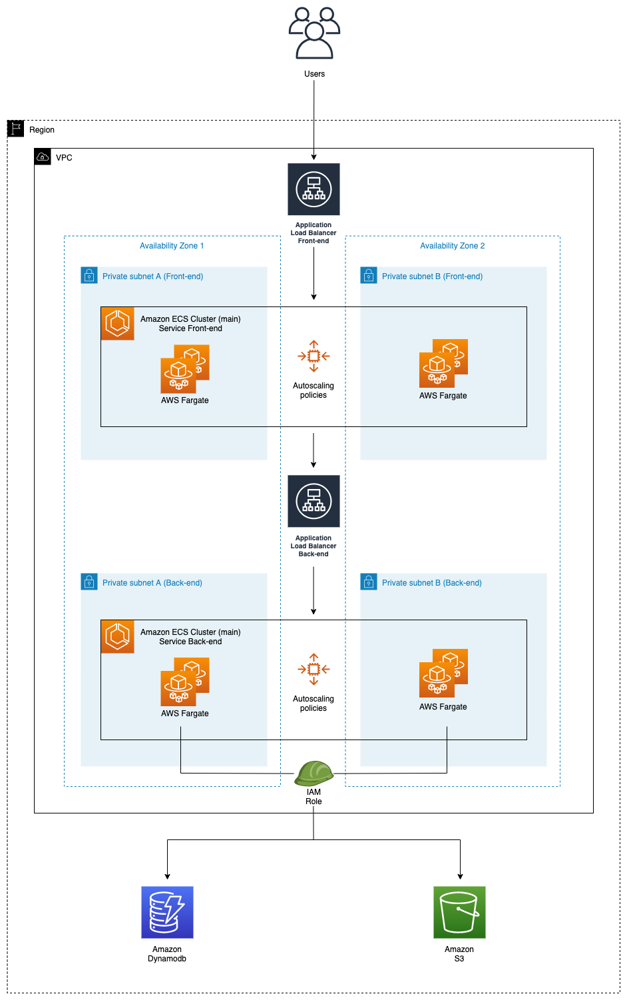
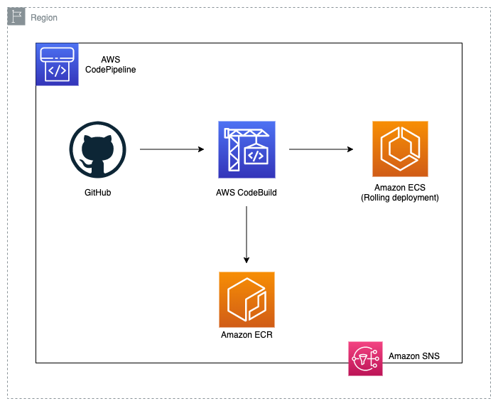

# Rolling Deployment

## Table of content

- [Rolling Deployment](#rolling-deployment)
  - [Table of content](#table-of-content)
  - [Folder overview](#folder-overview)
  - [Infrastructure](#infrastructure)
  - [Infrastructure Architecture](#infrastructure-architecture)
    - [Infrastructure considerations due to demo proposals](#infrastructure-considerations-due-to-demo-proposals)
  - [CI/CD Architecture](#cicd-architecture)
  - [Prerequisites](#prerequisites)
  - [Usage](#usage)
    - [Notifications](#notifications)
  - [Application Code](#application-code)
    - [Client app](#client-app)
    - [Client considerations due to demo proposals](#client-considerations-due-to-demo-proposals)
    - [Server app](#server-app)
  - [Cleanup](#cleanup)

## Folder overview

This folder contains Terraform code to deploy a solution that is intended to be used to run a demo. The deployment methodology used in this scenario is a Rolling one.

## Infrastructure

The AWS resources created by the script are detailed bellow:

- Networking
  - 2 ALBs - public facing ones (1 for the client and 1 for the server)
  - Security Groups
- Development code
  - 2 ECR Repositories (1 for the client and 1 for the server)
  - 1 S3 Bucket (used to store assets accessible from within the application)
  - 1 Dynamodb table (used by the application)
- ECS Infrastructure
  - 1 ECS Cluster
  - 2 ECS Services
  - 2 Task definitions
  - IAM roles
  - Security Groups
  - 2 Target groups
  - 2 Autoscaling groups + Cloudwatch rules for it
- CI/CD
  - 2 CodePipeline pipeline
  - 1 GitHub integration
  - 2 CodeBuild Projects
  - 2 ECS Rolling Deployment cofigurations
  - 1 S3 Bucket (used by CodePipeline to store the artifacts)
  - 1 SNS topic

## Infrastructure Architecture

The following diagram represents the Infrastructure architecture being deployed with this project:

<p align="center">
  
</p>

### Infrastructure considerations due to demo proposals

The task definition template (templates/taskdef.json) that enables the CodePipeline to execute a Blue/Green deployment in ECS has hardcoded values for the memory and CPU values for the server and client application.

Feel free to change it, by adding for example a set of "sed" commands in CodeBuild (following the ones already provided as example) to replace the values dynamically.

Feel fre to create a subscriptor for the SNS topic created by this code, in order to get informed of the status of each finished CodeDeploy deployment.

## CI/CD Architecture

The following diagram represents the CI/CD architecture being deployed with this project:

<p align="center">
  
</p>

## Prerequisites

Before launching this solution please deploy the `core-infra` solution, which is provided in the _examples_ folder of this repository.

## Usage

**1.** Fork this repository and create the GitHub token granting access to this new repository in your account.

**2.** Clone that recently forked repository from your account and change the directory to the appropriate one as shown below:

```bash
cd examples/rolling-deployment/
```

**3.** Create Github Token secret in Secret Manager. Go to [Secret Manager](https://console.aws.amazon.com/secretsmanager/secret) and create a secret named `ecs-github-token` with your Plaintext GitHub token value.

The value of this secret is the one generated during the Prerequisites from [this Readme](../core-infra/README.md#prerequisites) you did first. Remember to create your secret in the same region where you will deploy the rest of your infrastructure.

We recommend you to use this snippet for a fast creation from the cli:

```bash
aws secretsmanager create-secret \
    --name ecs-github-token \
    --secret-string "ghp_XXXXXXXXXXXXXXXXXXXXXXXXX"
```

**4.** Codestar notification rules require a **one-time** creation of a service-linked role. Please verify one exists or create the codestar-notification service-linked role.
  * `aws iam get-role --role-name AWSServiceRoleForCodeStarNotifications`

    ```An error occurred (NoSuchEntity) when calling the GetRole operation: The role with name AWSServiceRoleForCodeStarNotifications cannot be found.```
  *  If you receive the error above, please create the service-linked role with the `aws cli` below.
  * `aws iam create-service-linked-role --aws-service-name codestar-notifications.amazonaws.com`
  * Again, once this is created, you will not have to complete these steps for the other examples.

**5.** Run Terraform init to download the providers and install the modules

```shell
terraform init
```

**6.** Review the terraform plan output, take a look at the changes that terraform will execute, and then apply them:

```shell
terraform plan
terraform apply
```

**7.** Once Terraform finishes the deployment open the AWS Management Console and go to the AWS CodePipeline service. You will see that the pipeline, which was created by this Terraform code, is in progress. Add some files and Dynamodb items as mentioned [here](#client-considerations-due-to-demo-proposals). Once the pipeline finished successfully and the before assets were added, go back to the console where Terraform was executed, copy the _application_url_ value from the output and open it in a browser.


### Notifications

This projects creates a SNS topic, which is used by CodePipeline to notify execution status after complition. In order to receive those notifications please subscribe yourself to the generated topic in your account. For a step by step guidance and information please read [this](https://docs.aws.amazon.com/sns/latest/dg/sns-create-subscribe-endpoint-to-topic.html) documentation.

## Application Code

### Client app

The Client folder contains the code to run the frontend. This code is written in Vue.js and uses the port 80 in the deployed version, but when run localy it uses port 3000.

The application folder structure is separeted in components, views and services, despite the router and the assets.

### Client considerations due to demo proposals

1. The assets used by the client application are going to be requested from the S3 bucket created with this code. Please add 3 images to the created S3 bucket.

2. The Dynamodb structure used by the client application is the following one:

```shell
  - id: N (HASH)
  - path: S
  - title: S
```

Feel free to change the structure as needed. But in order to have full demo experience, please add 3 Dynamodb Items with the specified structure from above. Below is an example.

_Note: The path attribute correspondes to the S3 Object URL of each added asset from the previous step._

Example of a Dynamodb Item:

```json
{
  "id": {
    "N": "1"
  },
  "path": {
    "S": "https://mybucket.s3.eu-central-1.amazonaws.com/MyImage.jpeg"
  },
  "title": {
    "S": "My title"
  }
}
```

### Server app

The Server folder contains the code to run the backend. This code is written in Node.js and uses the port 80 in the deployed version, but when run localy it uses port 3001.

The server runs behind an internal load balancer, which avoids external access for security reasons.

Swagger was also implemented in order to document the APIs. The Swagger endpoint is provided as part of the Terraform output, it is an internal-facing link, so if feeling adventurous you can test the swagger documentation from within the containers.

The server exposes 3 endpoints:

- /status: serves as a dummy endpoint to know if the server is up and running. This one is used as the health check endpoint by the AWS ECS resources
- /api/getAllProducts: main endpoint, which returns all the Items from an AWS Dynamodb table
- /api/docs: the Swagger enpoint for the API documentation

## Cleanup

Run the following command if you want to delete all the resources created before:

```shell
terraform destroy
```
