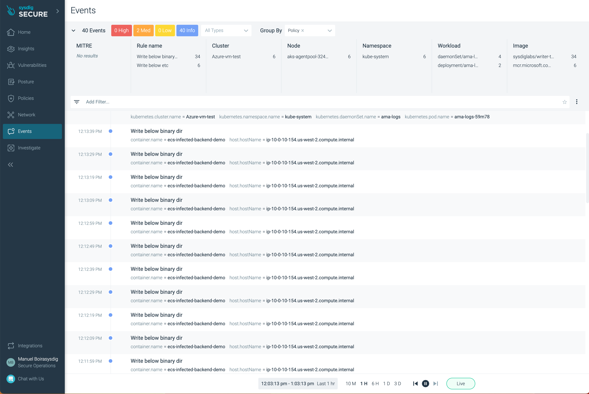

# ECS Fargate secured with Sysdig

This ECS blueprint creates a sample container emulating a backend workload secured with the [Sysdig Serverless Agent](https://docs.sysdig.com/en/docs/installation/serverless-agents/aws-fargate-serverless-agents/). A Sysdig Orchestrator agent is deployed together with the backend container instrumented with the Sysdig Workkload agent .
The demo container is a dummy automation acting as a threatening or infected application that will generate suspicious events in loop ([write below bin directory](https://falco.org/docs/rules/exceptions/)).

### Prerequisites
* AWS account
* Sysdig account (Request a [Free Trial account](https://sysdig.com/start-free/))

# Getting Started
* Deploy the [core-infra](../core-infra/README.md). Note if you have already deployed the infra then you can reuse it as well.
* In this folder, copy the `terraform.tfvars.example` file to `terraform.tfvars` and update the variables with the values that you can check in your Sysdig UI (Please check the tfvars comments for more information).
* **NOTE:** Codestar notification rules require a **one-time** creation of a service-linked role. Please verify one exists or create the codestar-notification service-linked role.
  * `aws iam get-role --role-name AWSServiceRoleForCodeStarNotifications`

    ```An error occurred (NoSuchEntity) when calling the GetRole operation: The role with name AWSServiceRoleForCodeStarNotifications cannot be found.```
  *  If you receive the error above, please create the service-linked role with the `aws cli` below.
  * `aws iam create-service-linked-role --aws-service-name codestar-notifications.amazonaws.com`
  * Again, once this is created, you will not have to complete these steps for the other examples.
* Now you can deploy the Sysdig ECS Fargate blueprint
```shell
terraform init
terraform plan
terraform apply -auto-approve
```

### Testing the Solution

Access to your Sysdig account via https://app.sysdigcloud.com (make sure you chose the same region that you chosen when registering the account).

<p align="center">
  
</p>


### More information
* Sysdig Serverless Agent Official Documentation: https://docs.sysdig.com/en/docs/installation/serverless-agents/aws-fargate-serverless-agents
* Sysdig blog posts
  *  "ECS Fargate Threat modeling": https://sysdig.com/blog/ecs-fargate-threat-modeling
  *  "Securing AWS Fargate workloads": https://sysdig.com/blog/securing-aws-fargate
* Serverless Agent Release Notes: https://docs.sysdig.com/en/docs/release-notes/serverless-agent-release-notes/
* SysdigLabs GitHub Repository: https://github.com/sysdiglabs/terraform-aws-fargate-orchestrator-agent
* Sysdig Terraform Provider: https://github.com/sysdiglabs/terraform-provider-sysdig
