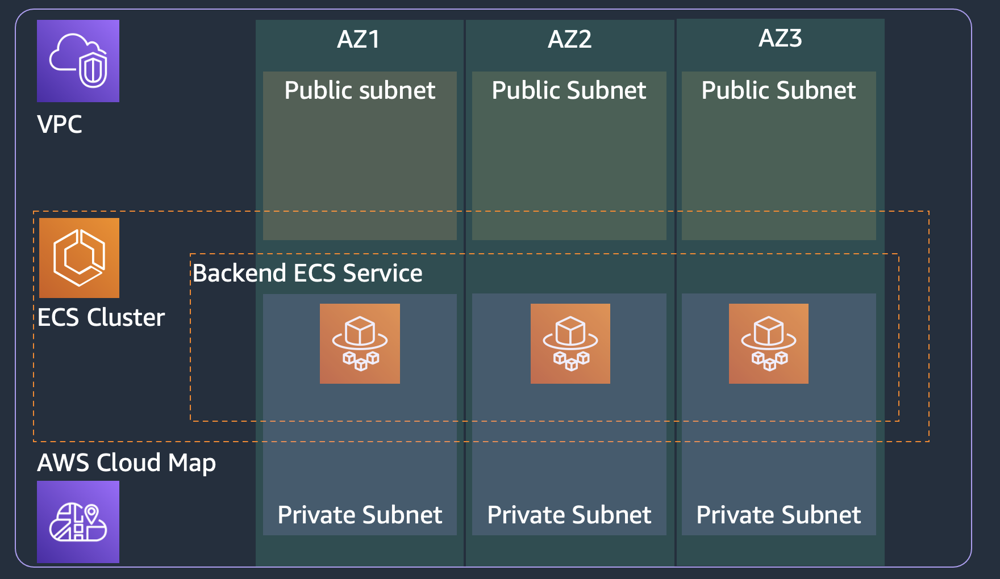

# ECS backend service with service discovery

This solution blueprint creates a backend service that **does not** sit behind a load balancer. The backend service has a service discovery name registered with AWS Cloud Map. Other services running in this cluster can access the backend service using the service discovery name. Below are steps for deploying this service:

* Deploy the [core-infra](../core-infra/README.md). Note if you have already deployed the infra then you can reuse it.
* Now you can deploy this blueprint
```shell
terraform init
terraform plan
terraform apply -auto-approve
```
* To test the backend service access using service discovery, deploy the [lb-service](../lb-service/README.md) along with providing the name of this backend service.

<p align="center">
  
</p>

The solution has following key components:

* Service discovery using AWS Cloud Map: The backend service can be given a service discovery name such as `backend.default.cluster-name.local`. The `backend` is service name, and `default` is the namespace alongwith further qualifier of `cluster-name.local`. Other services can interact with the backend service using the service discovery name. Here are the key aspects to note:
    * The namespace (i.e. `default.cluster-name.local`) is created in the [core-infra](../core-infra/README.md) blueprint. Many services can be registered to a namespace that is why we don't create the namespace in a specific service definition. We created them in the core-infra blueprint and you can easily add more namespaces there
    * We use `aws_service_discovery_dns_namespace` datasource to search and fetch the namespace.
    * The `aws_service_discovery_service` resource is used to register the service to the namespace. You see the record type, TTL, and health check setting in this resource.
* ECR registery for the container image. We are using only one container image for the task in this example.
* ECS service definition:
    * Task security group: allows ingress for TCP from all IP address in the VPC CIDR block to the container port (3000 in this example). And allows all egress.
    * Service discovery ARN is used in the service definition. ECS will automatically manage the registration and deregistration of tasks to this service discovery registry.
    * Tasks for this service will be deployed in private subnet
    * Task definition consisting of task vCPU size, task memory, and container information including the above created ECR repository URL.
    * Task definition also takes the task execution role ARN which is used by ECS agent to fetch ECR images and send logs to AWS CloudWatch on behalf of the task.
