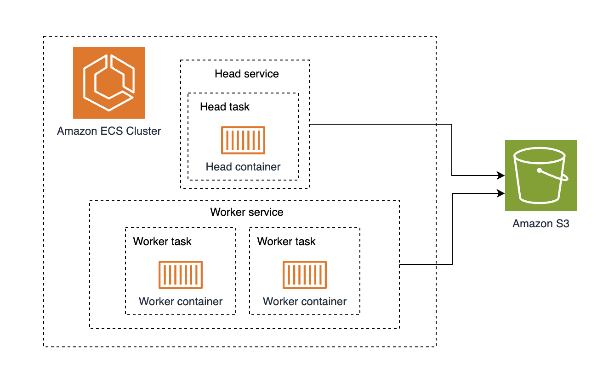

# ECS machine learning distributed training

This solution blueprint creates the infrastructure to run distributed training jobs using a [Ray cluster](https://docs.ray.io/en/latest/cluster/getting-started.html) and [PyTorch](https://pytorch.org/).



By default, this blueprint uses a set of three g5.12xlarge (with 4 GPUs) instances to showcase a multi-node, fully sharded data parallel distributed training. You can modify this blueprint to use larger instances from the local variable **instance_type_workers** and **instance_type_head** if you need more GPUs. - if you change the instance type, you need to also modify the worker task and service definition memory, CPU and GPUs and the container command parameters. The [training script example](./training_example.py) assumes 2 machines with a single GPU each, but can be changed via the **num_workers** variable.

## Components

* Service discovery: The head node is registered to a private DNS using local zones via cloud map. This allows worker tasks to discover the head task and join the cluster on start-up.
* 2 autoscaling groups: One for the head instance and another one for the worker instances
* ECS service definition:
    * Head service: runs singleton processes responsible for cluster management along with training jobs
    * Worker service: runs training jobs
* S3 bucket to store as shared storage

## Deployment

1. Deploy core-infra resources

```shell
cd ./terraform/ec2-examples/core-infra
terraform init
terraform apply -target=module.vpc -target=aws_service_discovery_private_dns_namespace.this
```

2. Deploy this blueprint

```shell
cd ../distributed-ml-training-fsdp
terraform init
terraform apply
```

It can take several minutes until the instances are created and connected to SSM

## Example: training the databricks/dolly-v2-7b model with the tiny_shakespeare dataset dataset

Once the instances are running, you can connect to the EC2 instance running the head container using SSM, and open a bash shell in the container from there. This is only for demonstration purposes - Using notebooks with [SageMaker](https://aws.amazon.com/sagemaker/) or [Cloud 9](https://aws.amazon.com/cloud9/) provide a better user experience to run training jobs in python than using the bash shell.

1. Connect to the head instance

```bash
HEAD_INSTANCE_ID=$(aws ec2 describe-instances \
  --filters 'Name=tag:Name,Values=ecs-demo-distributed-ml-training-head' 'Name=instance-state-name,Values=running' \
  --query 'Reservations[*].Instances[0].InstanceId' --output text --region us-west-2
)
aws ssm start-session --target $HEAD_INSTANCE_ID --region us-west-2
```

2. Connect to the container

Due to the size of the container images, it might take several minutes until the containers reach a running state. The following command will fail if the container is not running.

```
CONTAINER_ID=$(sudo docker ps -qf "name=.*-rayhead-.*")
sudo docker exec -it $CONTAINER_ID bash
```

3. Inside the container shell, check the cluster status. 3 nodes should be listed as healthy with 2.0 GPUs available - If you do not see 2.0 GPUs, the workers have not started yet.

```bash
ray status
```

Example output:

```
(…)
Node status
---------------------------------------------------------------
Active:
 1 node_ae3cba0ce4b9196f86f23efaa3b5cf53cb3956d96162d0965e901cf5
 1 node_0a46d6a2d9b0f1f88f0b3ba7bc0237e512e5435c9cab454e20c95f52
 1 node_7839a944b0cc9213137490d8cccb7bd7eb4c9fbc8b6f56123532bdc7
(…)

```

4. Run the [training script example](./training_example.py) - It uses fully sharded data parallel to split the data between GPUs. You can look at the comments inside the python script to learn more about each step. A bucket is created as part of the terraform plan (Bucket name is printed as output). Make sure to add the name of that bucket (starts with "dt-results-") as argument of the training_example.py script

```bash
cd /tmp
wget https://raw.githubusercontent.com/aws-ia/ecs-blueprints/main/terraform/ec2-examples/distributed-ml-training-fsdp/training_example.py
python training_example.py REPLACE_WITH_YOUR_BUCKET_NAME
```

Example output:

```
(RayTrainWorker pid=364, ip=10.0.0.218) Setting up process group for: env:// [rank=0, world_size=12]
(TorchTrainer pid=287, ip=10.0.0.218) Started distributed worker processes: 
(TorchTrainer pid=287, ip=10.0.0.218) - (node_id=47a3d7c20ebb914a34340d9a4cdd08d8b8f35051eb7d1821431e0d97, ip=10.0.0.218, pid=364) world_rank=0, local_rank=0, node_rank=0
(…)
Epoch 0: : 1it [00:26, 26.64s/it, v_num=0, train_loss=13.00]
(…)
Epoch 0: : 129it [43:14, 20.11s/it, v_num=0, train_loss=0.162]
(…)
╭─────────────────────────────────────────╮
│ Training result                         │
├─────────────────────────────────────────┤
│ checkpoint_dir_name   checkpoint_000000 │
│ time_this_iter_s             2968.97071 │
│ time_total_s                 2968.97071 │
│ training_iteration                    1 │
│ epoch                                 0 │
│ step                                129 │
│ train_loss                      0.16882 │
╰─────────────────────────────────────────╯
(…)
Training finished iteration 1 at 2025-01-10 19:56:58. Total running time: 51min 37s

```

It can take approximately an hour for the scrip to finish. The terraform plan deploys a custom dashboard in CloudWatch  named "distributed-ml-training-fsdp" with memory and utilization of the GPUs in the cluster. Once the training finishes, it should show GPUs utilized near 100% and memory between 10 and 20 GB used.

## Clean up

1. Destroy this blueprint

```shell
terraform destroy
```

1. Destroy core-infra resources

```shell
cd ../core-infra
terraform destroy

```

## Support

Please open an issue for questions or unexpected behavior
