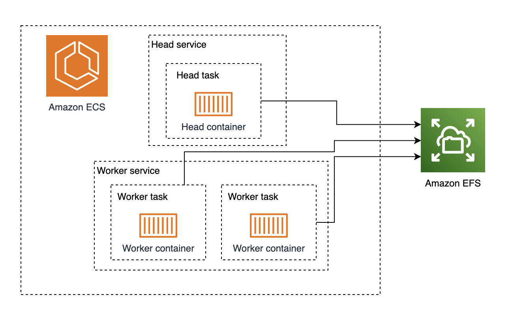

# ECS machine learning distributed training

This solution blueprint creates the infrastructure to run distributed training jobs using a [Ray cluster](https://docs.ray.io/en/latest/cluster/getting-started.html) and [PyTorch](https://pytorch.org/). The Ray head node runs on a m5.xlarge instance, while the 2 workers run on g5.12xlarge instances.



## Cost warning!

By default, this blueprint uses g5.12xlarge (with 4 GPUs) to showcase multi-GPU and multi-node distributed training, but **can increase costs considerably over time**. You can modify this blueprint to use g5.xlarge (with one GPU) instead from the local variable **instance_type_workers** - if you change the instance type, you need to also modify the worker task definition to use 1 GPU instead of 4 (see **resource_requirements** and container command parameter **--num-gpus**) and the example training script outline below (see **num_workers** parameter)

## Components

* Service discovery using AWS Cloud Map: The head node is registerer to a private DNS using loca zones via cloud map. This allow workers to discover the head service and join the cluster
* 2 autoscaling groups: One for the head instance and other for the worker instances
* ECS service definition:
    * Task security group, task role and task execution role and
    * Service discovery ARN is used in the service definition. ECS will automatically manage the registration and deregistration of tasks to this service discovery registry.
    * Tasks for this service will be deployed in single private subnet to avoid AZ data transfer costs
    * Task definitions with GPU resource requirements
* EFS file system for shared storage between the ECS cluster tasks

## Deployment

```shell
terraform init
terraform plan
terraform apply
```

## Example: training the resnet18 model with the FashionMNIST dataset

Once the cluster is deployed, you can connect to the EC2 instance running the head container using SSM, and open a bash shell in the container from there. This is only for demonstration purposes - [SageMaker notebooks](https://aws.amazon.com/sagemaker/notebooks/) provide a better user experience to run training jobs in python than using the bash shell

```bash
HEAD_INSTANCE_ID=$(aws ec2 describe-instances \
  --filters 'Name=tag:Name,Values=ecs-demo-distributed-ml-training-head' \
  --query 'Reservations[*].Instances[*].InstanceId' --output text)

aws ssm start-session --target $HEAD_INSTANCE_ID
CONTAINER_ID=$(sudo docker ps -qf "name=.*rayhead.*")
sudo docker exec -it $CONTAINER_ID bash
```

```python
export RAY_DEDUP_LOGS=0 # Makes the logs verbose per each process in the training
python

# import required torch and ray libraries
import tempfile
import torch
from torchvision.models import resnet18
from torchvision.datasets import FashionMNIST
from torchvision.transforms import ToTensor, Normalize, Compose
from torch.utils.data import DataLoader
from torch.optim import Adam
from torch.nn import CrossEntropyLoss
from ray.train.torch import TorchTrainer
from ray.train import ScalingConfig, Checkpoint
import ray
from pprint import pprint
import time
from pprint import pprint

# Connect to the Ray cluster
ray.init()

# Download the data in the shared storage
transform = Compose([ToTensor(), Normalize((0.5,), (0.5,))])
train_data = FashionMNIST(root='/home/ray/ray_results/data',
                          train=True, download=True,
                          transform=transform)

# Define the training function that the distributed processes will run
def train_func(config):
    import os
    # The NVIDIA Collective Communications Library (NCCL) implements multi-GPU
    # and multi-node communication primitives optimized for NVIDIA GPUs.
    # Since containers can have multiple interfaces, we explicitly set which one
    # NCCL should use.
    os.environ['NCCL_SOCKET_IFNAME']='eth0'
    #os.environ['NCCL_DEBUG']='INFO' Uncomment this line if you want to debug NCCL
    # Set up the model
    model = resnet18(num_classes=10)
    model.conv1 = torch.nn.Conv2d(1, 64, kernel_size=(7, 7),
                                  stride=(2, 2),
                                  padding=(3, 3),
                                  bias=False)
    # Prepare model for distributed training
    model = ray.train.torch.prepare_model(model)
    # Setup loss and optimizer
    criterion = CrossEntropyLoss()
    optimizer = Adam(model.parameters(), lr=0.001)
    # Retrieve the data from the shared storage.
    transform = Compose([ToTensor(), Normalize((0.5,), (0.5,))])
    train_data = FashionMNIST(root='/home/ray/ray_results/data', train=True, download=False, transform=transform)
    train_loader = DataLoader(train_data, batch_size=128, shuffle=True)
    # Prepare dataloader for distributed training
    train_loader = ray.train.torch.prepare_data_loader(train_loader)
    # Define training loop
    for epoch in range(10):
        start = time.time()
        for images, labels in train_loader:
            outputs = model(images)
            loss = criterion(outputs, labels)
            optimizer.zero_grad()
            loss.backward()
            optimizer.step()
        print(f"[GPU{torch.cuda.current_device()}: Process rank {torch.distributed.get_rank()}] | [Epoch {epoch} | Batchsize: {128} | Steps: {len(train_loader)} | Total epoch time: {time.time()-start}]")
        # Only save checkpoint after the last epoch
        if epoch == 9:
            checkpoint_dir = tempfile.gettempdir()  
            checkpoint_path = checkpoint_dir + "/model.checkpoint"
            torch.save(model.state_dict(), checkpoint_path)
            # Report metrics and checkpoint to Ray.
            ray.train.report({"loss": loss.item()},checkpoint=Checkpoint.from_directory(checkpoint_dir))

# The scaling config defines how many workers
# In this case is equal to the total GPU count  
scaling_config = ScalingConfig(num_workers=8, use_gpu=True)

# Create the trainer instance
trainer = TorchTrainer(train_func,
                       scaling_config=scaling_config)

# Run the training
result = trainer.fit()

# Print the results of the training
print(result)

```

## Clean up

```shell
terraform destroy
```


## Support

Please open an issue for questions or unexpected behaviour
