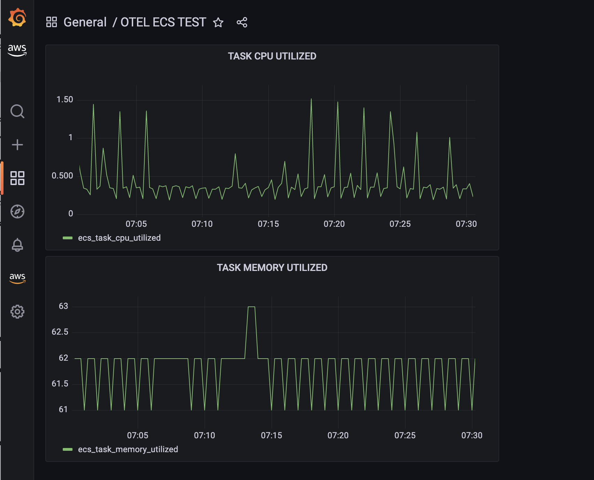

# Using AWS Open Telemetry Agent with Amazon Managed Prometheus and Grafana
[Amazon Managed Service for Prometheus (AMP)](https://aws.amazon.com/prometheus) is a Prometheus-compatible monitoring and alerting service that makes it easy to monitor containerized applications and infrastructure at scale. [Amazon Managed Grafana (AMG)](https://aws.amazon.com/grafana) is a fully managed service for open source Grafana developed in collaboration with Grafana Labs. Grafana is a popular open source analytics platform that enables you to query, visualize, alert on and understand your metrics no matter where they are stored. [AWS Distro for OpenTelemetry (OTEL)](https://aws.amazon.com/otel) is a secure, production-ready, AWS-supported distribution of the OpenTelemetry project. Part of the Cloud Native Computing Foundation, OpenTelemetry provides open source APIs, libraries, and agents to collect distributed traces and metrics for application monitoring.

In this ECS Solution Blueprint, we will use AWS OpenTelemetry agent to collect both custom application metrics and infrastructure metrics (CPU, memory, etc.), send them to Amazon Managed Prometheus, and visualize them using Amazon Managed Grafana. This solution is based on the [Getting Started Guide for OTEL and AMP for ECS](https://aws-otel.github.io/docs/getting-started/prometheus-remote-write-exporter/ecs).

### Prerequisites
Follow the [AMP](https://docs.aws.amazon.com/prometheus/latest/userguide/AMP-getting-started.html) and [AMG](https://docs.aws.amazon.com/grafana/latest/userguide/getting-started-with-AMG.html) documentation to setup prometheus and grafana workspace respectively. The AMP workspace creation is a simple one step process. The AMG workspace requires a mechanism to authenticate users for accessing Grafana dashboard. You can set this up using AWS SSO or SAML based federated authentication.

### Getting Started
* Deploy the [core-infra](../core-infra/README.md). Note if you have already deployed the infra then you can reuse it as well.
* From the previously created AMP workspace, copy the remote-write endpoint. It will have this form, `https://aps-workspaces.<region>.amazonaws.com/workspaces/<workspace-id>/api/v1/remote_write`.
* Open the `ecs-adot-config.yaml` in this folder, and change the `AMP_REMOTE_WRITE_ENDPOINT` with above URL and change the REGION to region of AMP workspace.
* Now you can deploy this blueprint
```shell
terraform init
terraform plan
terraform apply -auto-approve
```

### Testing the Solution
Access your AMG workspace that was setup in the prerequisites. In the left panel, find AWS icon, select `Data sources`, select `Amazon Managed Servive for Prometheus`  and find the AMP workspace created above by using appropriate region and account.

In the left panel, find the `+` icon and create a `Dashboard`. In the create dashboard, select `Add a new panel`. From metrics browser select `ecs_task_cpu_utilized`, you should see the metrics from the task created above.
<p align="center">
  
</p>

### Solution Details
The following are important aspects to note in the solution:
* The OpenTelemetry agent is running as sidecar along with the application container. They are both part of the same Fargate task.
* The OpenTelemetry agent configuration has two aspects
    * The configuration YAML which has all the details for scraping and sending the metrics including the AMP workspace and region that was set above. This YAML is stored in the AWS Systems Manager Parameter Store (`adot_config_ssm_parameter = "otel-collector-config"`). When OpenTelemetry container is started, ECS fetches the value from the parameter store and assigns to the environment variable `AOT_CONFIG_CONTENT` (defined in the `map_secrets` input variable in `terraform.tfvars`).
    * The application container name and port to scrape for custom metrics are provided in the `map_environment={"PROMETHEUS_SAMPLE_APP":"prometheus-sample-app:8080"}` input variable instructing OpenTelemetry agent to scrape from port 8080 for the `prometheus-sample-app` container.
    * The OpenTelemetry agent gets the infrastructure metrics using the built-in AWS ECS Container Metrics Receiver.
