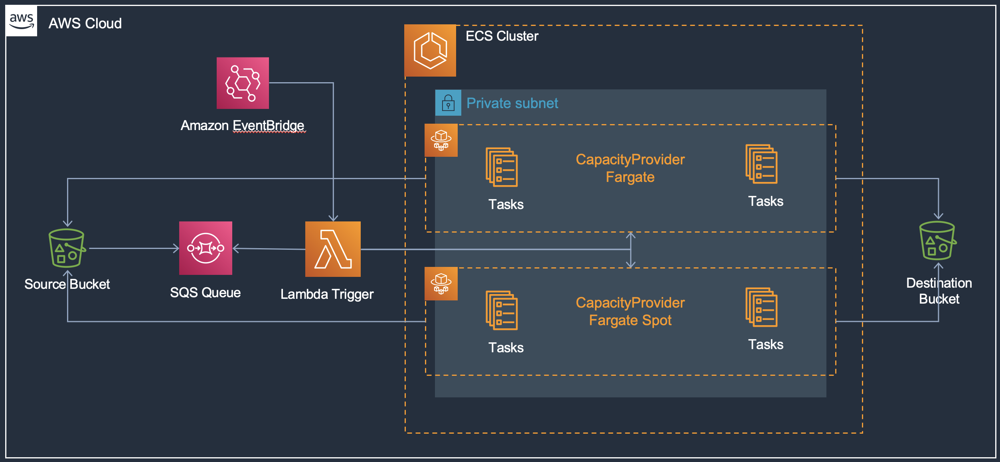

# ECS Fargate Autoscaling Queue Processing

This solution blueprint deploys an end to end data processing pipeline using ECS Fargate, Lambda, S3, and SQS. This use case will process a massive number of files in S3 to be consumed or used by another job or service. For example, resizing images into a standard 224x224 or 299x299 format for deep learning.

This blueprint expects files uploaded to an S3 source bucket which trigger S3 event notifications and publish file metadata to SQS. On a regular 2 minute CloudWatch event rule, a Lambda function is invoked which checks the SQS queue for the `ApproximateNumberOfMessages` attribute and lauches Fargate tasks based on queue depth using the ECS `run_task()` API. The tasks are designed to continue processing and draining the SQS queue before scaling down to 0 tasks automatically, eliminating the need to keep a fixed pool of ECS tasks running.

* Deploy the [core-infra](../core-infra/README.md). Note if you have already deployed the infra then you can reuse it as well.
* **NOTE:** Codestar notification rules require a **one-time** creation of a service-linked role. Please verify one exists or create the codestar-notification service-linked role.
  * `aws iam get-role --role-name AWSServiceRoleForCodeStarNotifications`

    ```An error occurred (NoSuchEntity) when calling the GetRole operation: The role with name AWSServiceRoleForCodeStarNotifications cannot be found.```
  *  If you receive the error above, please create the service-linked role with the `aws cli` below.
  * `aws iam create-service-linked-role --aws-service-name codestar-notifications.amazonaws.com`
  * Again, once this is created, you will not have to complete these steps for the other examples.
* Now you can deploy this blueprint
```shell
terraform init
terraform plan
terraform apply -auto-approve
```
* To test, upload a lot of `.jpg` image files to the S3 source bucket
```bash
aws s3 cp . s3://ecsdemo-queue-proc-source-xx-xxx-xxx-xx/ecsproc --recursive
```
* Check the SQS queue for the notificatiosn from the S3 bucket file upload, check CloudWatch Container Insights to see the task count increase from the Lambda run_task invocation, and check destination S3 bucket for resizes images.

## Blueprint Architecture

<p align="center">
  
</p>

The solutions has following key components:

* S3 source bucket to upload the image files and S3 destination bucket where the resized images are copied.
* SQS queue which receives notifications when files are uploaded to S3 source bucket
* Lambda function that runs every 2 minute to check queue depth and launch Fargate tasks using ECS `run_task()` API. Lambda will launch (`ApproximateNumberofMessages`/10) upto a max of 10 tasks. These settings are configurable if you want to launch more or less tasks depending on your use case.
* ECS Fargate task processes the image from source S3 bucket and copies to destination S3 bucket. The task is "long running" and will continue processing messages remaining in the queue. Once queue is empty the tasks will quit. This provides a built-in scale to 0.
* ECS Fargate tasks are distributed to run on a mix of Fargate on-demand and Fargate Spot instances. This provides considerable cost savings from Fargate Spot.

The rest of the components provide CI/CD pipeline to build and update the ECS Fargate image processing task.

* **Please make sure you have stored the Github access token in AWS Secrets Manager as a plain text secret (not as key-value pair secret). This token is used to access the *application-code* repository and build images.**
* S3 bucket to store CodePipeline assets. The bucket is encrypted with AWS managed key.
* 2 S3 buckets for source and destination artifacts
* SNS topic for notifications from the pipeline
* CodeBuild for building queue processing container image
    * Needs the S3 bucket created above
    * IAM role for the build service
    * The *buildspec_path* is a key variable to note. It points to the [buildspec.yml](../../../application-code/container-queue-proc/templates/buildspec.yml) file which has all the instructions not only for building the container but also for pre-build processing and post-build artifacts preparation required for deployment.
    * A set of environment variables including repository URL and folder path.
* CodePipeline to listen for changes to the repository and trigger build and deployment.
    * Needs the S3 bucket created above
    * Github token from AWS Secrets Manager to access the repository with *application-code* folder
    * Repository owner
    * Repository name
    * Repository branch
    * SNS topic for notifications created above
    * The cluster and service names for deploying the tasks with new container images
    * The image definition file name which contains mapping of container name and container image. These are the containers used in the task.
    * IAM role

Note that the CodeBuild and CodePipeline services are provisioned and configured here. However, they primarily interact with the *application-code/container-queue-proc* repository. CodePipeline is listening for changes and checkins to that repository. And CodeBuild is using the *Dockerfile* and *templates/* files from that application folder.
