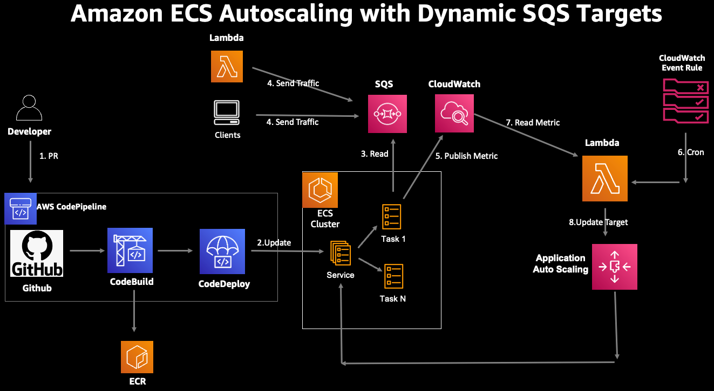
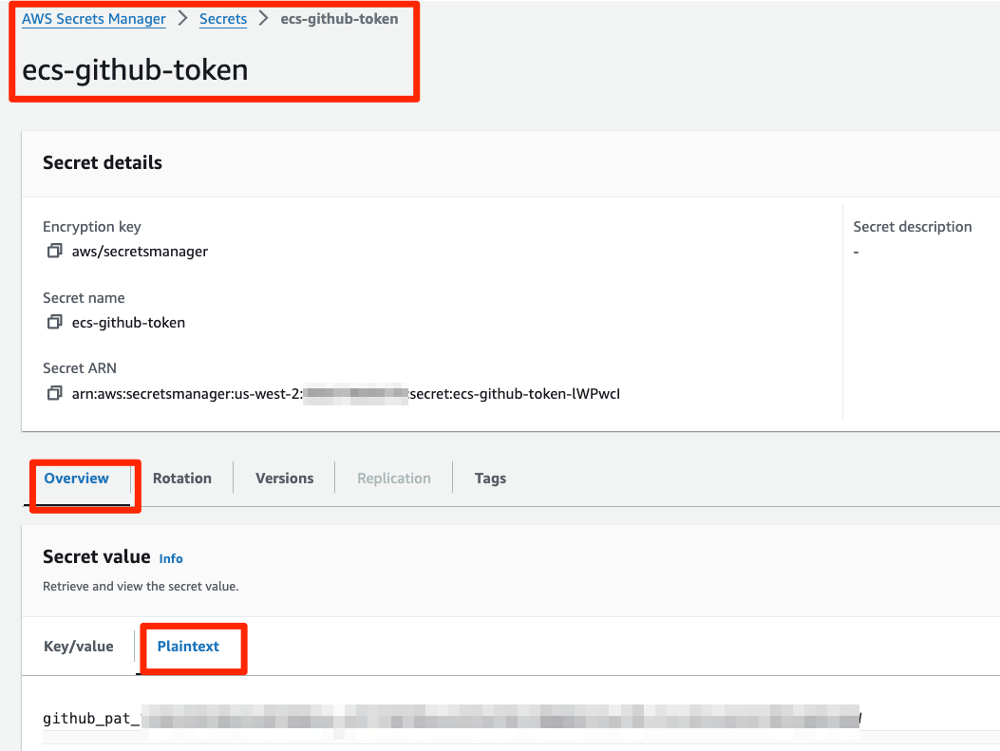
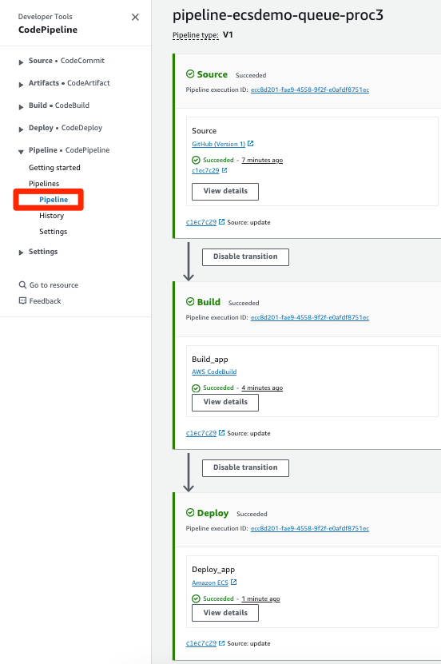
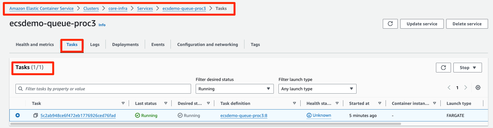
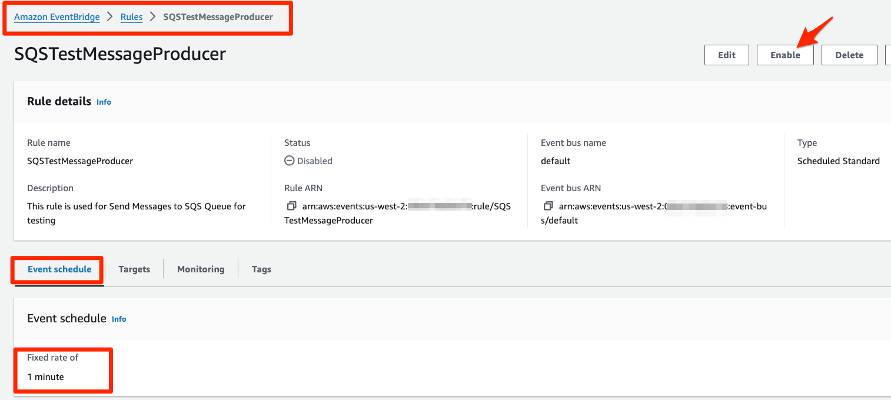
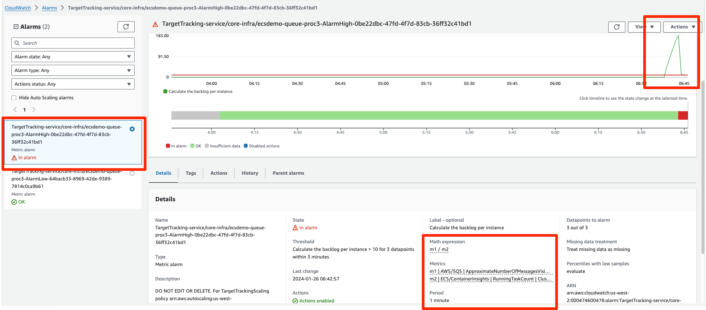
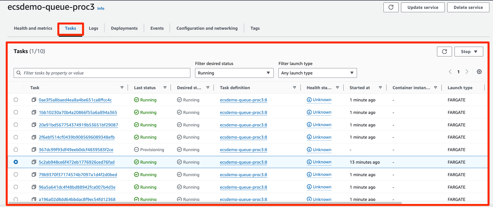

# ECS Fargate Application Autoscaling With Dynamic Target Tracking for SQS Queue Processing

## Solution Overview

This solution blueprint deploys an end to end data processing pipeline using ECS Fargate, Lambda, and SQS. The workload has the following requirements,

1. messages comes to SQS Queue on a regular interval.
2. each message processing duration varies.
3. ECS Service needs to scale to handle the messages at scale

For latency-sensitive applications, [AWS guidance describes a common pattern](https://docs.aws.amazon.com/autoscaling/ec2/userguide/as-using-sqs-queue.html) that allows an ECS Service to scale in response to the backlog of an Amazon SQS queue while accounting for the average message processing duration (MPD) and the application’s desired latency.

This blueprint expects samples messages to be available in the SQS Queue. The blueprint provisions a lambda which runs every minute via Event bridge rule with a cron expression. This Eventbridge rule is disabled by default. Once the workload is ready to test, you can enable it to start sending `50` messages to SQS Queue every 1 minute.

Every message in the SQS Queue has a field to denote the message processes time in seconds. The ECS Task does the following Operations.

1. reads a message from SQS Queue
2. sleeps for the duration of message processing time
3. delete the message from SQS Queue
4. Publish a metric to CloudWatch with value of the message processing time

The ECS Servie is scaled using Target Tracking using a custom metric. The custom metric is ecsBPI (ecs Backlog per instance) and is calculated as follows.

ecsBPI =  ApproximateNumberOfMessages / no of ECS tasks

The target used for ECS Service Target tracking is ecsTargetBPI.

ecsTargetBPI = (maximum acceptable delay) / MPD

## Solution Blueprint Architecture

<p align="center">
  
</p>

The solutions has following key components:

* Lambda function to send test message to the SQS Queue
* SQS queue which holds the messages
* Lambda function that runs every 1 hour to adjust the Target for the ECS Service Target Tracking Scaling policy.
* ECS Service which processes the message from SQS Queue by reading it and sleeping for MPD
* CodePipeline to build and deploy the image to the ECS Cluster.

* **Please make sure you have stored the Github access token in AWS Secrets Manager as a plain text secret (not as key-value pair secret). This token is used to access the *application-code* repository and build images.**

<p align="center">
  
</p>

* Clone repository to your laptop/Clooud9 VM.
* S3 bucket to store CodePipeline assets. The bucket is encrypted with AWS managed key.
* 2 S3 buckets for source and destination artifacts
* SNS topic for notifications from the pipeline
* CodeBuild for building queue processing container image
    * Needs the S3 bucket created above
    * IAM role for the build service
    * The *buildspec_path* is a key variable to note. It points to the [buildspec.yml](../../../application-code/ecsdemo-queue-proc/templates/buildspec.yml) file which has all the instructions not only for building the container but also for pre-build processing and post-build artifacts preparation required for deployment.
    * A set of environment variables including repository URL and folder path.
* CodePipeline to listen for changes to the repository and trigger build and deployment.
    * Github token from AWS Secrets Manager to access the repository with *application-code* folder
    * Repository owner
    * Repository name
    * Repository branch
    * SNS topic for notifications created above
    * The cluster and service names for deploying the tasks with new container images
    * The image definition file name which contains mapping of container name and container image. These are the containers used in the task.
    * IAM role


## Deploy the Solution

* Deploy the [core-infra](../core-infra/README.md). Note if you have already deployed the infra then you can reuse it as well.
* **NOTE:** Codestar notification rules require a **one-time** creation of a service-linked role. Please verify one exists or create the codestar-notification service-linked role.
  * `aws iam get-role --role-name AWSServiceRoleForCodeStarNotifications`
    ```An error occurred (NoSuchEntity) when calling the GetRole operation: The role with name AWSServiceRoleForCodeStarNotifications cannot be found.```
  *  If you receive the error above, please create the service-linked role with the `aws cli` below.
  * `aws iam create-service-linked-role --aws-service-name codestar-notifications.amazonaws.com`
  * Again, once this is created, you will not have to complete these steps for the other examples.
* Now you can deploy this blueprint
```shell
cd ../sqs-dynamic-target-tracking
terraform init
terraform plan
terraform apply -auto-approve
```

## Test the Solution

* Do a simple dummy change in your Github repo and push the change to start the CodePipeline to build the application container image and push to ECS Service. Note that the CodeBuild and CodePipeline services are provisioned and configured here. However, they primarily interact with the *application-code/ecsdemo-queue-proc* repository. CodePipeline is listening for changes and checkins to that repository. And CodeBuild is using the *Dockerfile* and *templates/* files from that application folder.
* Ensure that CodePipeline is running successful

<p align="center">
  
</p>
* Initally there will be one ECS task in the ECS Service

<p align="center">
  
</p>
* To start sending messages to SQS queue for testing, Go to Eventbridge Console and enable the Eventbridge rule `SQSTestMessageProducer`

<p align="center">
  
</p>

* The Application will start processing messages from SQS Queue and will emit a CloudWatch metric `MsgProcessingDuration`

* The Alarm for the Application Autoscaling Policy based on Target Tracking using Custom CloudWatch Metrcs Expreession, trigers the ECS Service Autoscaling
<p align="center">
  
</p>

* The ECS Service is Autoscaled based on the Application Autoscaling using the Target Tracking Policy
<p align="center">
  
</p>
